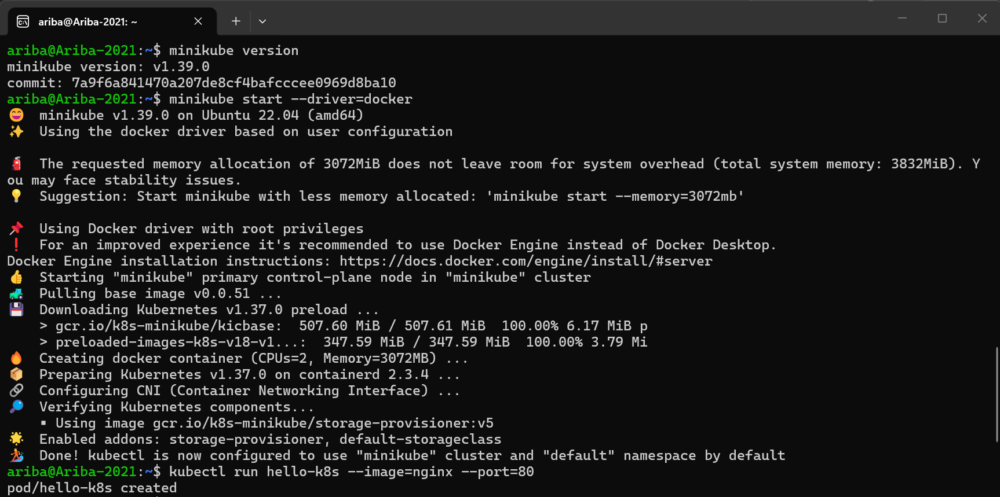
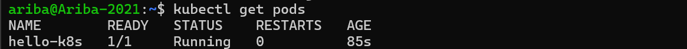
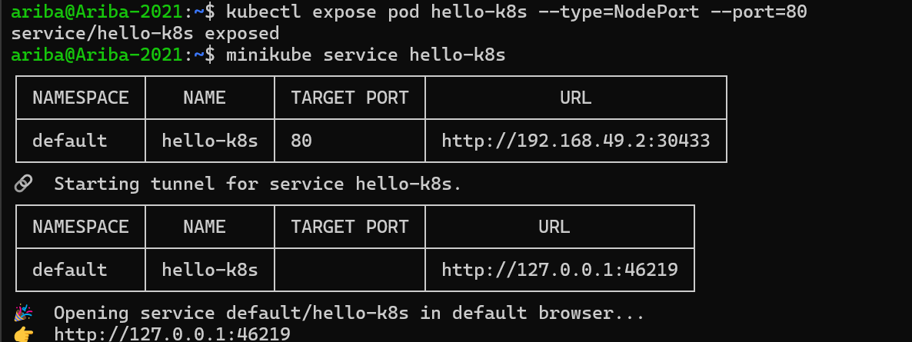
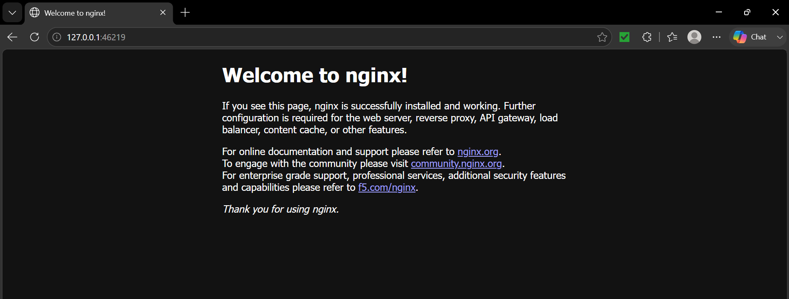

# DevOps-1BM23IS036
# DevOps Exercise 1: Hello Pod

## Objective
Deploy an nginx container as a Pod on Kubernetes (via Minikube), expose it as a Service, 
and access it in the browser — simulating deployment of a storefront web app.

## Steps Performed
1. Started a local Kubernetes cluster using Minikube (`minikube start --driver=docker`)
2. Created a Pod running the nginx image (`kubectl run hello-k8s --image=nginx --port=80`)
3. Verified the Pod was running (`kubectl get pods`)
4. Exposed the Pod as a NodePort Service (`kubectl expose pod hello-k8s --type=NodePort --port=80`)
5. Accessed the Nginx welcome page via `minikube service hello-k8s`

## Screenshots

### 1. Minikube cluster started

### 2. Pod running

### 3. Service exposed

### 4. Nginx welcome page in browser

## Outcome
Successfully deployed and accessed nginx running inside a Kubernetes Pod, confirming 
the app is portable, running reliably, and ready to be scaled.
