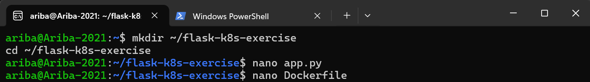
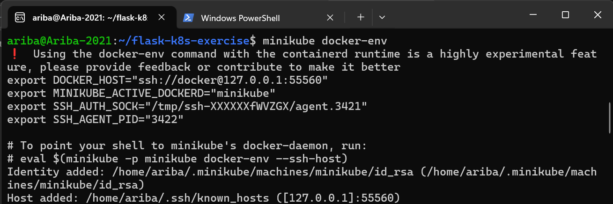
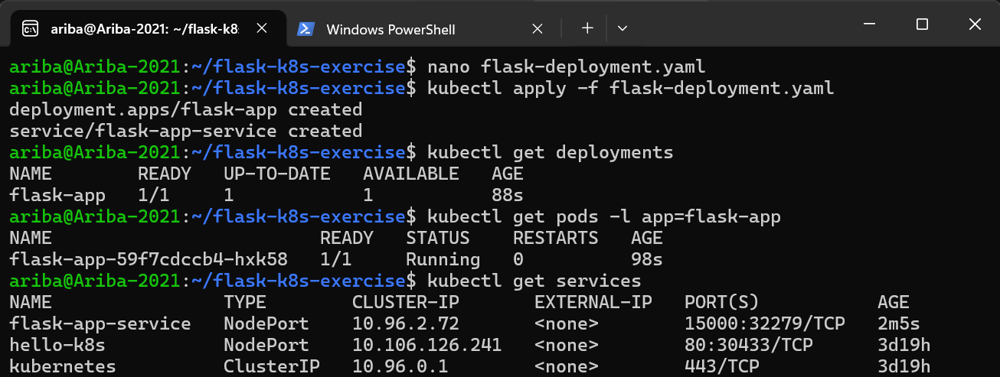
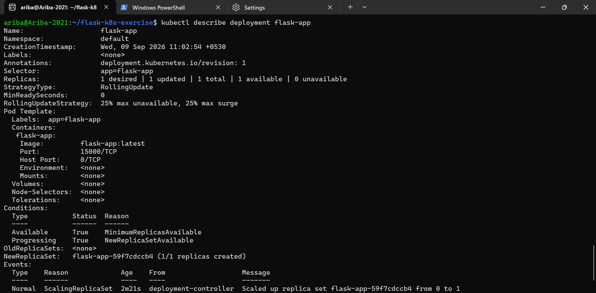
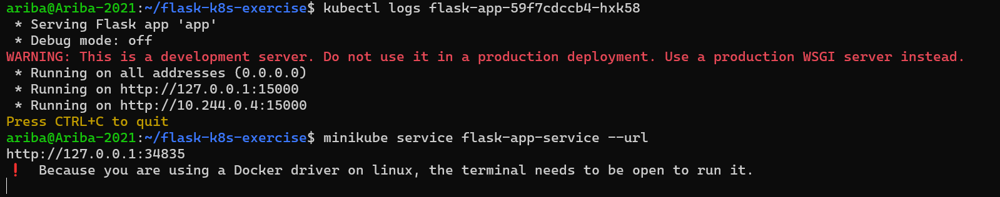
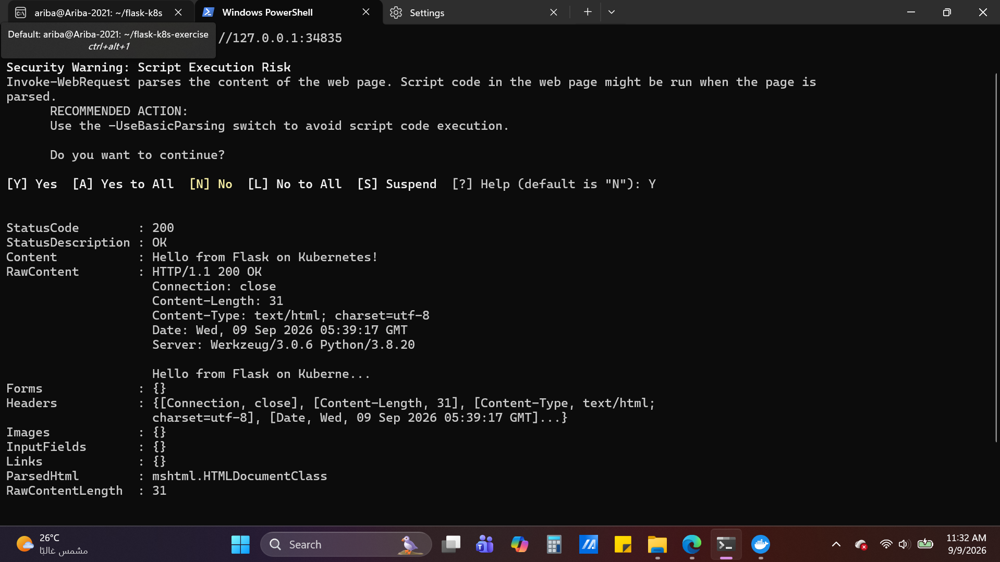
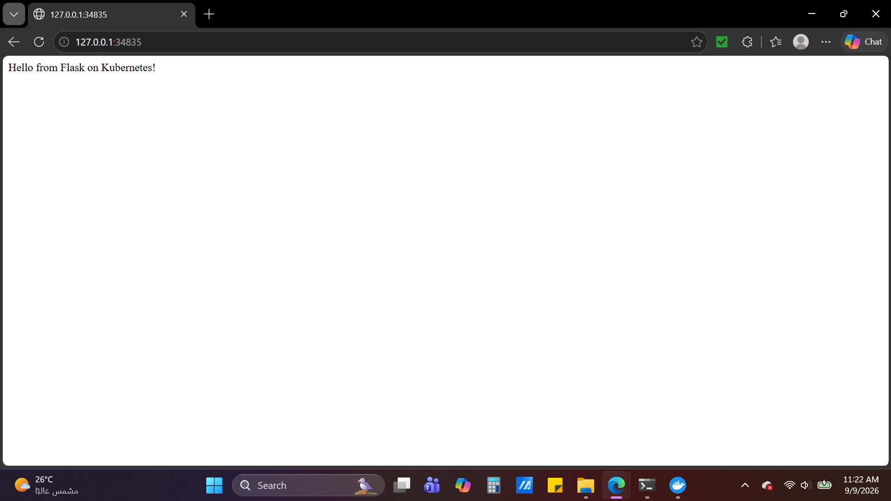

# DevOps Exercise 2: Flask App on Kubernetes

## Objective

Deploy a Python Flask application as a Docker container on Kubernetes (via Minikube), expose it as a Service, and access it in the browser — demonstrating a full build-to-deploy workflow for a custom application image.

## Steps Performed

1. Created the project folder and wrote the Flask app (`app.py`) returning `"Hello from Flask on Kubernetes!"` on port 15000, along with a `Dockerfile` to containerize it (`mkdir ~/flask-k8s-exercise`, `nano app.py`, `nano Dockerfile`).
2. Pointed the local Docker CLI to Minikube's Docker daemon so the image would be available inside the cluster (`eval $(minikube docker-env)`), then built the image (`docker build -t flask-app .`).
3. Created `flask-deployment.yaml` defining a Deployment (1 replica, `imagePullPolicy: Never` to use the locally built image) and a NodePort Service mapping port 15000, then applied it and verified the rollout (`kubectl apply -f flask-deployment.yaml`, `kubectl get deployments`, `kubectl get pods -l app=flask-app`, `kubectl get services`).
4. Inspected the deployment in detail to confirm configuration and rollout events (`kubectl describe deployment flask-app`).
5. Checked the pod logs to confirm Flask was serving correctly, then exposed the service externally (`kubectl logs <pod-name>`, `minikube service flask-app-service --url`).
6. Accessed the running app through both a browser and PowerShell's `Invoke-WebRequest` (aliased as `curl`), confirming a `200 OK` response with the expected message. Note: since Minikube runs on the Docker driver on Windows/WSL2, `minikube service --url` tunnels through a dynamically assigned local port (e.g. `http://127.0.0.1:34835`) rather than the container's internal port (15000) — this is expected behavior, not an error.

## Screenshots

### 1. Project setup

### 2. Minikube Docker environment configured

### 3. Deployment and Service applied

### 4. Deployment described

### 5. Flask logs and service URL exposed

### 6. Accessed via PowerShell (200 OK)

### 7. Accessed via browser

