# DevOps Exercise 3: Scaling a Flask App on a Single Node using ReplicaSets

## Objective

Deploy a Python Flask "flash sale" application on Kubernetes (via Minikube) using a **ReplicaSet**, scale it up and down, observe self-healing when a pod is deleted, and verify that traffic is load-balanced across multiple pod replicas.

## Steps Performed

### 1. Docker image built and pushed to Docker Hub

Wrote the Flask app (`app.py`) with `/`, `/buy`, and `/health` endpoints, and a `Dockerfile` to containerize it. Logged in to Docker Hub via Docker Desktop, then built and pushed the image (`docker build -t aribatabassum/flashsale:1.0 .`, `docker push aribatabassum/flashsale:1.0`).

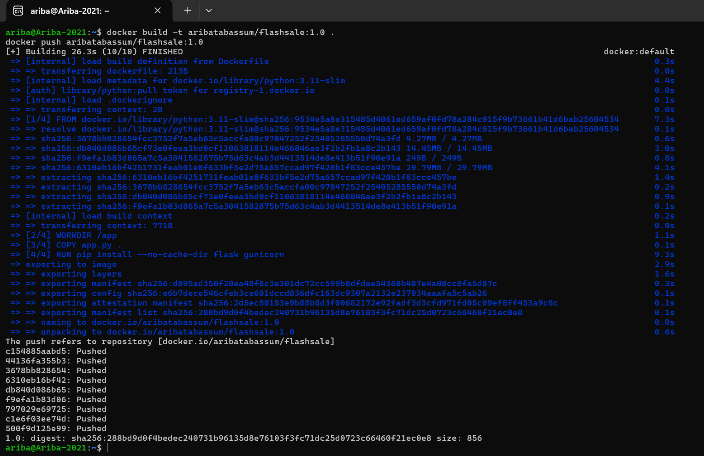

### 2. Verified image on Docker Hub

Confirmed the `aribatabassum/flashsale` repository was created and the image was pushed successfully.

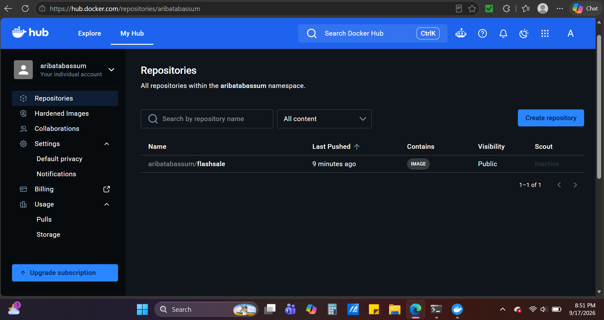

### 3. Minikube cluster started

Cleaned up any previous cluster and started a fresh single-node Minikube cluster (`minikube stop`, `minikube delete`, `minikube start --nodes=1`).

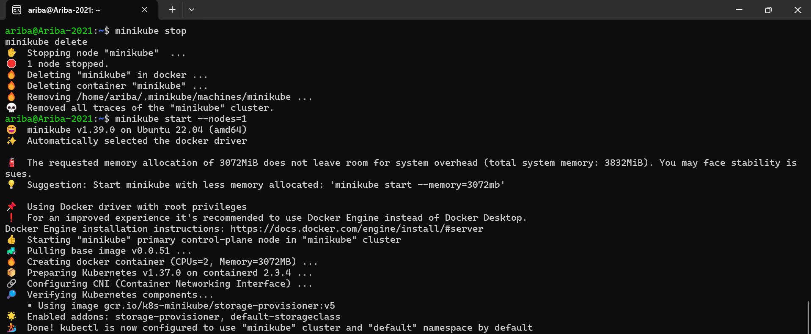

### 4. Verified the node

Confirmed the Minikube node was up and ready (`kubectl get nodes`).

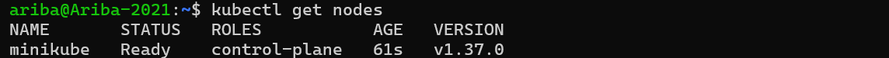

### 5. ReplicaSet and Service applied

Wrote `flashsale-replicaset.yaml` defining a ReplicaSet (3 replicas, using the Docker Hub image `aribatabassum/flashsale:1.0`) and a ClusterIP Service, then applied it (`kubectl apply -f flashsale-replicaset.yaml`).

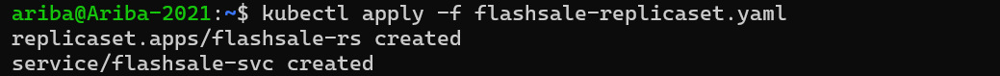

### 6. Verified 3 pods running

Confirmed all 3 pods came up and were running (`kubectl get pods`, `kubectl get rs`).

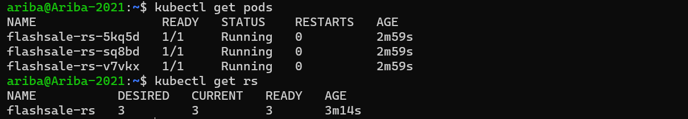

### 7. Scaled up to 5 replicas

Scaled the ReplicaSet from 3 to 5 (`kubectl scale rs flashsale-rs --replicas=5`) and confirmed 5 pods came up and became ready.

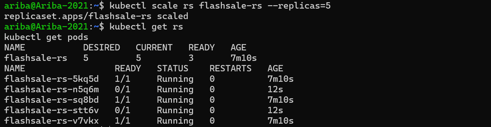

### 8. Pod self-healing demonstrated

Deleted one running pod directly (`kubectl delete pod flashsale-rs-5kq5d`) to simulate a failure. Re-checked the pod list and confirmed the ReplicaSet automatically created a new pod to replace it, keeping the total at 5 — proving Kubernetes' self-healing behavior.

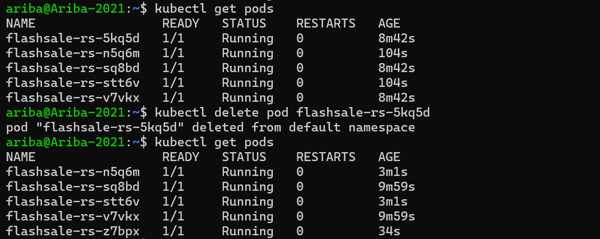

### 9. Pod distribution verified

Checked which node each pod was scheduled on and its assigned IP (`kubectl get pods -o wide`), confirming all 5 pods were distributed and running on the single Minikube node.

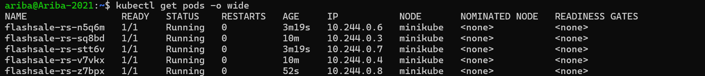

### 10. Service exposed externally

Exposed the ClusterIP service for local access (`minikube service flashsale-svc --url`), which returned a local tunnel URL (`http://127.0.0.1:34271`).

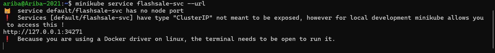

### 11. Accessed the homepage via browser

Visited the service URL in the browser and confirmed the welcome message, along with the name of the pod that served the request.

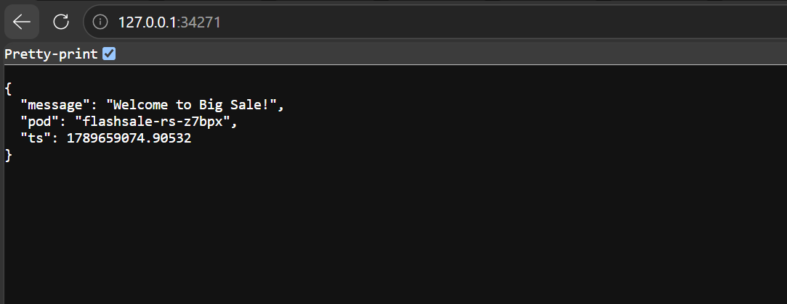

### 12–15. Tested /buy endpoint for load distribution

Hit the `/buy` endpoint multiple times through the browser. Each response showed a different `served_by_pod` value (`flashsale-rs-stt6v`, `flashsale-rs-sq8bd`, `flashsale-rs-z7bpx`), confirming that requests were being load-balanced across different pod replicas rather than always hitting the same one.

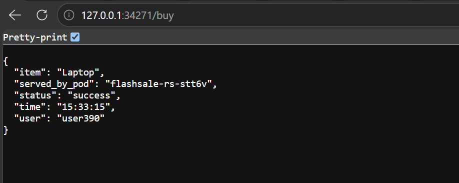

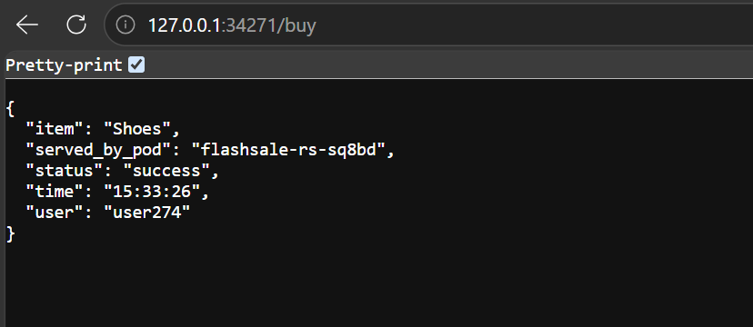

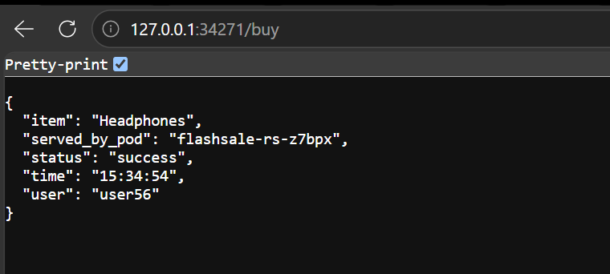

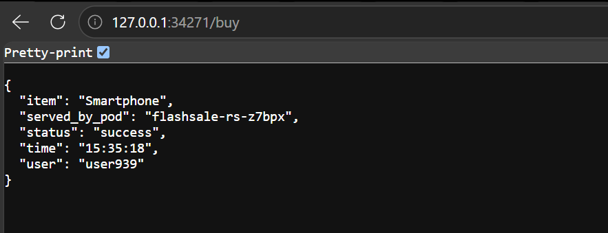
