# DevOps Exercise 4: Docker Networking with Flask, MySQL and Redis

## Objective

Build a three-container application (a **Flask** REST API, a **MySQL** database and a **Redis** cache) and connect all three to a single **user-defined Docker bridge network** (`my-bridge-net`). The exercise demonstrates:

- how containers on the same custom network discover each other **by name** (Docker's embedded DNS) instead of hard-coded IP addresses,
- how **port publishing** (`-p 5001:5001`) exposes only the Flask API to the host machine, while MySQL and Redis stay reachable only inside the network,
- why Flask must bind to `0.0.0.0` inside a container.

## Architecture

```
                    Browser / Host
                         │
                    localhost:5001
                         │
                         ▼
                 ┌──────────────┐
                 │ Flask :5001  │
                 │    flask     │
                 └──────┬───────┘
                        │
                 my-bridge-net
                ┌───────┴────────┐
                │                │
                ▼                ▼
         ┌────────────┐   ┌────────────┐
         │ MySQL      │   │ Redis      │
         │ mysql:3306 │   │ redis:6379 │
         └────────────┘   └────────────┘
```

## Environment

- Windows with **WSL2 (Ubuntu)** and **Docker Desktop**
- All commands were run from the Ubuntu terminal inside `~/docker-networking-lab`

## Files in this folder

| File | Purpose |
| --- | --- |
| `app.py` | Flask REST API with a `/about` endpoint, listening on `0.0.0.0:5001` |
| `requirements.txt` | Pinned dependencies (`Flask==2.0.1`, `Werkzeug==2.0.3`) |
| `Dockerfile` | Builds the Flask image from `python:3.9-slim` |

## Steps Performed

### 1. Verified Docker is working

Checked that the Docker CLI and engine were responding before starting (`docker --version`, `docker ps`). Docker version 29.7.2 was installed and `docker ps` returned an empty container list, which is expected on a clean setup.

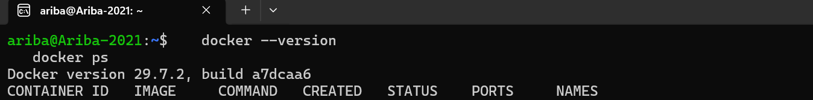

### 2. Created the working directory

Moved into the project directory `~/docker-networking-lab` (`cd ~/docker-networking-lab`, `pwd`, `ls`). It contains the three files used to build the Flask image: `Dockerfile`, `app.py` and `requirements.txt`.

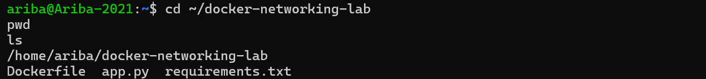

### 3. Created the custom bridge network

Created a user-defined bridge network with `docker network create --driver bridge my-bridge-net`. The network had already been created earlier in the lab, so running the command again returned "network with name my-bridge-net already exists". `docker network ls` confirms `my-bridge-net` (driver `bridge`, scope `local`) is present alongside the default networks.

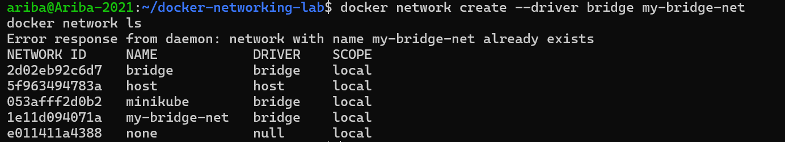

### 4. Inspected the network

Ran `docker network inspect my-bridge-net` to examine the network before attaching any containers. It shows the name `my-bridge-net`, driver `bridge`, subnet `172.18.0.0/16` and gateway `172.18.0.1`. The `Containers` section was empty at this point.

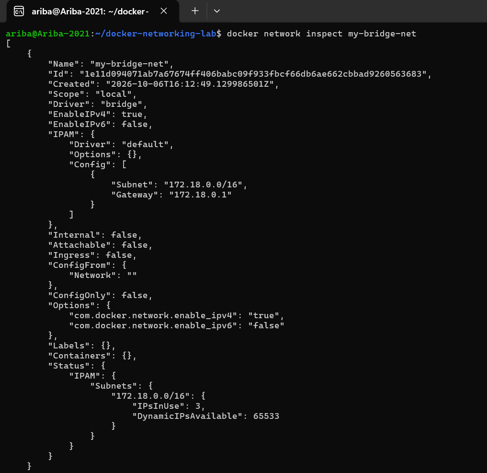

### 5. Created and verified the Flask application files

Created the three files needed for the image and verified their contents with `cat`:

- `app.py`: a Flask app exposing `GET /about`, returning JSON, and running with `host='0.0.0.0'` so it accepts connections from outside the container, not only from the container's own loopback interface.
- `requirements.txt`: pins `Flask==2.0.1` and `Werkzeug==2.0.3`. Werkzeug is pinned because Flask 2.0.1 breaks with newer Werkzeug releases (`ImportError: cannot import name 'url_quote'`).
- `Dockerfile`: uses `python:3.9-slim`, sets `/app` as the working directory, copies the two files, installs the requirements, exposes port 5001 and starts `python app.py`.

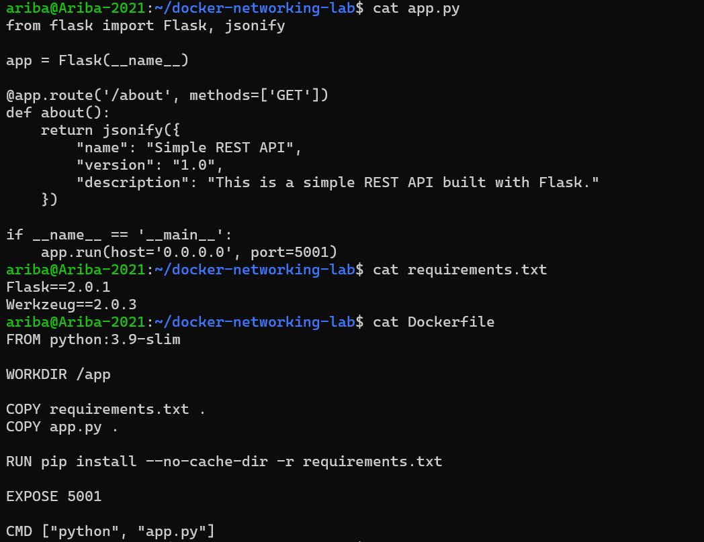

### 6. Built the Flask image

Built the image without using the cache (`docker build --no-cache -t flask-api .`). The build completed successfully (all 11 steps) and the image was tagged `flask-api:latest`. The first attempt failed with a temporary `502 Bad Gateway` from Docker Hub while pulling the `python:3.9-slim` base image; retrying the same command succeeded.

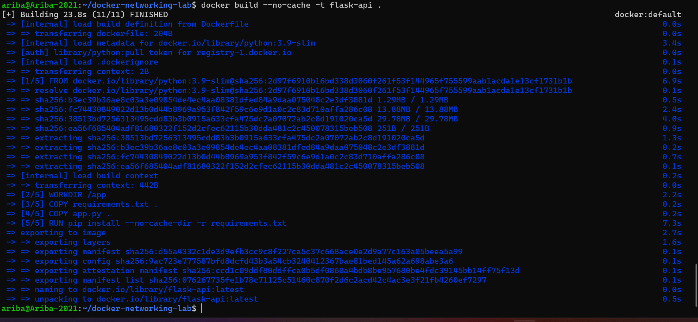

### 7. Listed images and started a standalone test container

Confirmed the new `flask-api:latest` image appears in `docker images`. Then started the image on its own to test it before wiring it into the network (`docker run -d --name flask-test -p 5001:5001 flask-api`). The container started and port `5001` was published. The first `curl` was sent about two seconds after startup and returned "Connection reset by peer", because Flask had not finished starting yet.

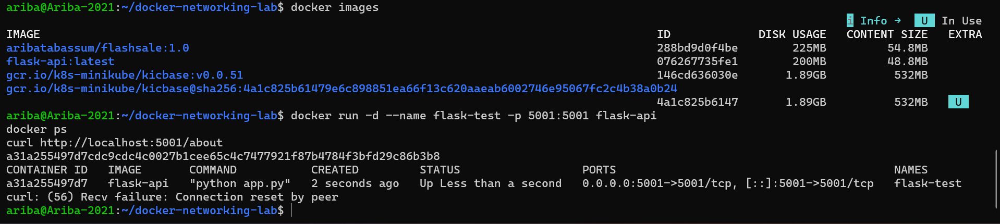

### 8. Verified the Flask API responds

After waiting a moment, `curl http://localhost:5001/about` returned the expected JSON (`name`, `version` and `description`), and `docker ps` showed `flask-test` running with `0.0.0.0:5001->5001/tcp`. This confirms the image works correctly on its own. The test container was then removed (`docker rm -f flask-test`) to free port 5001.

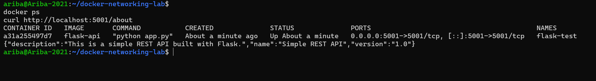

### 9. Started MySQL on the custom network

Started a MySQL container attached to the custom network with an explicit root password and an initial database:

```bash
docker run -d --name mysql --network my-bridge-net \
  -e MYSQL_ROOT_PASSWORD=rootpass -e MYSQL_DATABASE=devopsdb mysql:latest
```

The `mysql:latest` image was not available locally, so Docker pulled it automatically. No ports were published, since only containers inside the network need to reach MySQL.

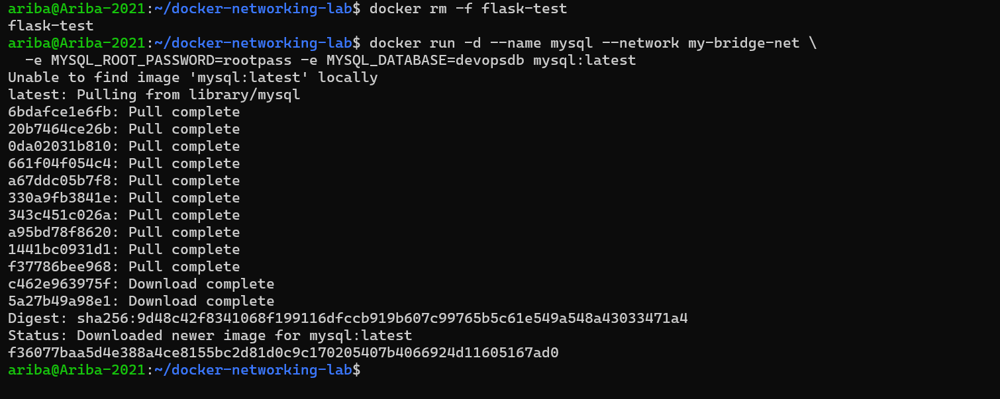

### 10. Started Redis on the custom network

Started Redis on the same network (`docker run -d --name redis --network my-bridge-net redis:latest`). `docker ps` shows both `redis` and `mysql` running, with only their internal ports (`6379/tcp` and `3306/tcp`) and no host port mappings.

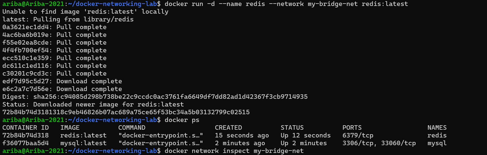

### 11. Started Flask on the same network

Started the Flask container on `my-bridge-net`, publishing port 5001 to the host:

```bash
docker run -d --name flask --network my-bridge-net -p 5001:5001 flask-api
```

`-p 5001:5001` uses the format `HOST_PORT:CONTAINER_PORT`. `docker ps` now shows all three containers (`flask`, `redis`, `mysql`) running. Only Flask has a host port mapping (`0.0.0.0:5001->5001/tcp`).

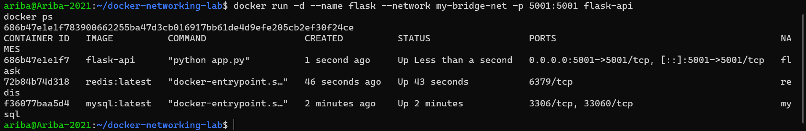

### 12. Verified all containers are attached to the network

Ran `docker network inspect my-bridge-net` again. The `Containers` section now lists all three containers with their own addresses on the `172.18.0.0/16` subnet: `mysql` (172.18.0.2), `redis` (172.18.0.3) and `flask` (172.18.0.4).

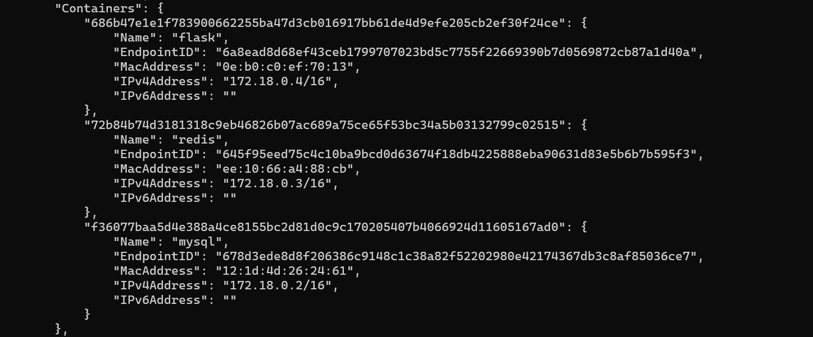

### 13. Verified MySQL

Checked that MySQL had finished initialising (the logs show "MySQL init process done. Ready for start up.") and queried it from inside the container:

```bash
docker exec -it mysql mysql -uroot -prootpass -e "SHOW DATABASES;"
```

The output lists `devopsdb` (created through `MYSQL_DATABASE`) together with the default databases `information_schema`, `mysql`, `performance_schema` and `sys`. (The warning about using a password on the command line is expected for this lab setup.)

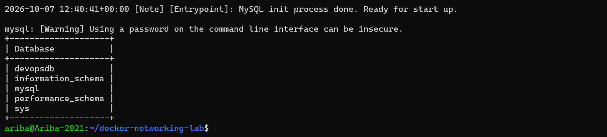

### 14. Final verification of the whole setup

Ran the full set of verification commands:

- `docker ps` shows `flask`, `redis` and `mysql` all running.
- `docker port flask` shows port `5001/tcp` mapped to `0.0.0.0:5001`.
- `curl http://localhost:5001/about` returns the JSON response, proving host to Flask access works through the published port.
- `docker exec flask getent hosts mysql` returns `172.18.0.2` and `docker exec flask getent hosts redis` returns `172.18.0.3`, proving that from inside the Flask container, Docker's DNS resolves the **container names** `mysql` and `redis` to their IP addresses on the custom network.

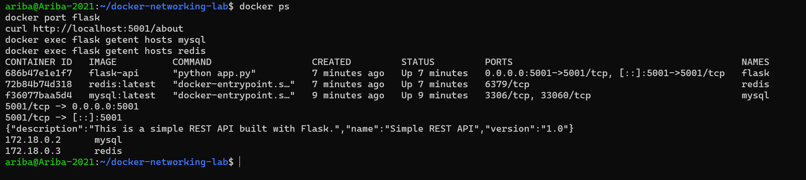

### 15. Cleaned up the containers

Stopped and removed the lab containers and tried to remove the network (`docker stop`, `docker rm`, `docker network rm`). The screenshot shows "No such container" and "network not found" errors, because the containers and network had already been removed by the time these commands were run. It also shows that only the unrelated `minikube` container from an earlier exercise remains.

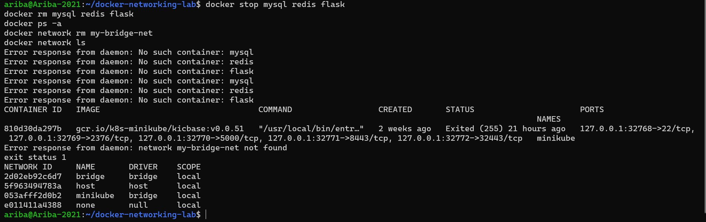

### 16. Verified the cleanup

Final check with `docker ps -a` and `docker network ls`: none of the `flask`, `mysql` or `redis` containers remain, and `my-bridge-net` no longer appears in the network list. Only the default networks (`bridge`, `host`, `none`) and the `minikube` network from the previous Kubernetes exercises are left.

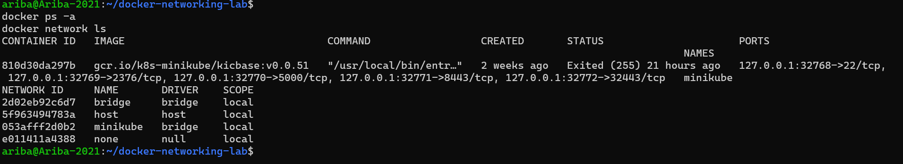

## Key Concepts Demonstrated

- **User-defined bridge network:** containers attached to the same custom network can communicate directly with each other and are isolated from containers on other networks.
- **Service discovery by name:** Docker's embedded DNS resolves container names (`mysql`, `redis`) to IP addresses, so applications never need hard-coded IPs, which can change when containers are recreated.
- **Port publishing vs. internal networking:** `-p HOST_PORT:CONTAINER_PORT` is only needed for access from outside the Docker network (host to Flask). Flask reaches MySQL and Redis internally, so ports 3306 and 6379 are not published.
- **Binding to `0.0.0.0`:** Flask must listen on all interfaces inside the container. Binding to `127.0.0.1` would make the app unreachable through the published port.
- **Reproducible dependencies:** pinning `Flask==2.0.1` and `Werkzeug==2.0.3` avoids version-incompatibility errors at build and run time.

## Result

A Flask API, a MySQL database and a Redis cache ran together on the `my-bridge-net` bridge network. The Flask API was reachable from the host at `http://localhost:5001/about`, and container-to-container name resolution (`flask` to `mysql` and `redis`) was verified with `getent hosts`. All lab containers and the network were removed at the end.
