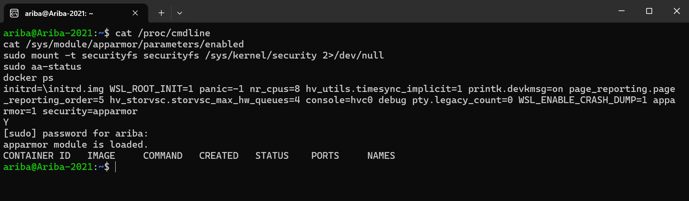
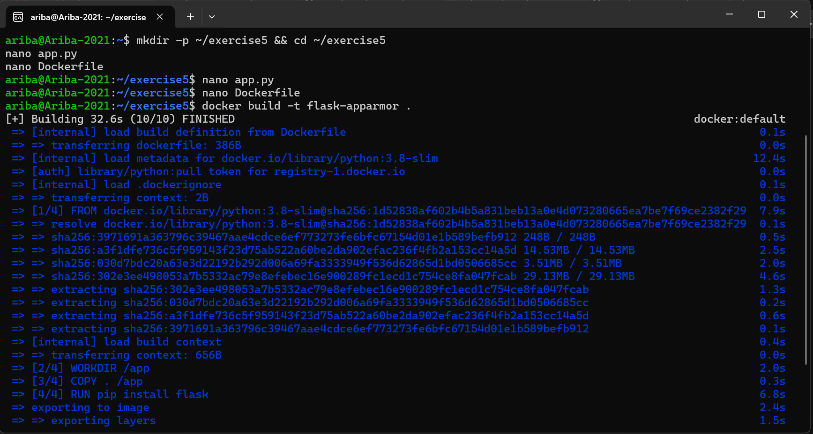
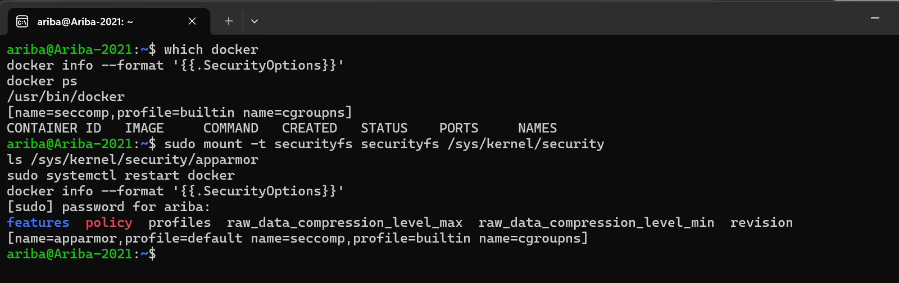
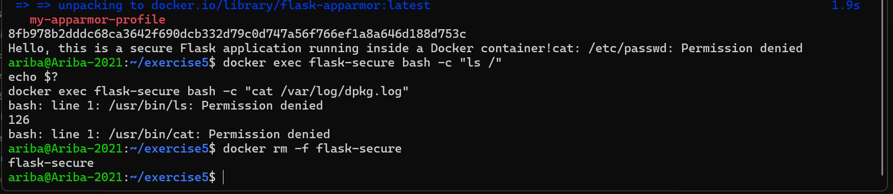
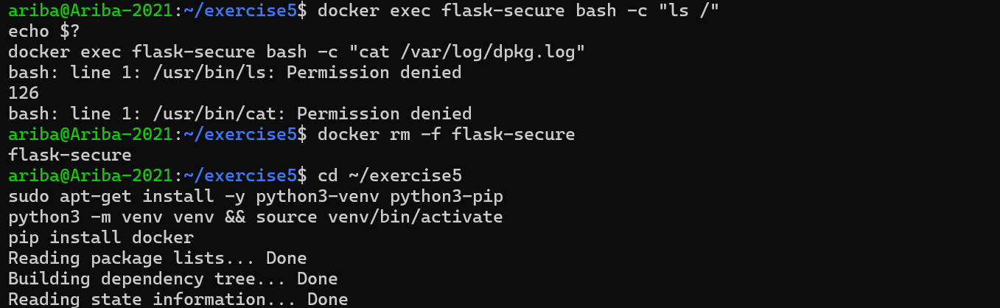
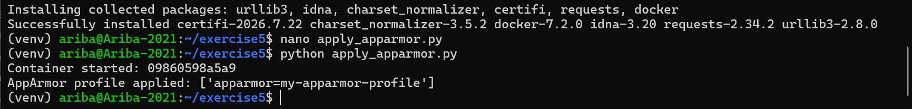
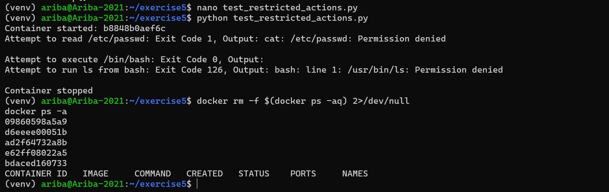

# DevOps Exercise 5: Docker Security with AppArmor and Python

## Objective

Secure a Python Flask application running inside a Docker container using a custom **AppArmor** profile. The profile restricts access to sensitive files (`/etc/passwd`, `/var`) and prevents the execution of binaries from `/bin` and `/usr/bin`. The profile is applied and verified through the **Docker SDK for Python**, and the restrictions are then tested with Python scripts.

## Files in this folder

| File | Purpose |
|------|---------|
| `app.py` | Simple Flask application served on port 5000 |
| `Dockerfile` | Containerizes the Flask app (`python:3.8-slim`) |
| `my-apparmor-profile` | Custom AppArmor profile (stored at `/etc/apparmor.d/my-apparmor-profile`) |
| `apply_apparmor.py` | Builds the image, runs the container with the profile via the Docker SDK, and verifies it |
| `test_restricted_actions.py` | Runs the container and tests restricted actions with `exec_run` |

## Environment

- Windows with WSL2 (Ubuntu 22.04)
- Docker Engine installed natively inside Ubuntu (see Step 3 for why)
- Python 3 virtual environment with the `docker` SDK (`pip install docker`)

## Steps Performed

### 1. Enabled AppArmor in the WSL2 kernel

AppArmor was not active by default in WSL2 (`/sys/module/apparmor/parameters/enabled` did not exist). Updated WSL (`wsl --update`, now WSL 3.0.1 with kernel 6.18), installed `apparmor` and `apparmor-utils` in Ubuntu, and added the following to `C:\Users\ariba\.wslconfig` to turn the module on at boot:

```
[wsl2]
kernelCommandLine = apparmor=1 security=apparmor
```

After `wsl --shutdown` and a restart, `/proc/cmdline` showed `apparmor=1 security=apparmor`, the `enabled` file printed `Y`, and `aa-status` reported that the AppArmor module is loaded.



### 2. Created the Flask app and built the Docker image

Created the project folder `~/exercise5` with `app.py` (a Flask app returning a hello message on `/`, listening on `0.0.0.0:5000`) and a `Dockerfile` based on `python:3.8-slim` that copies the app, installs Flask, exposes port 5000, and runs `python app.py`. Built the image with:

```bash
docker build -t flask-apparmor .
```



### 3. Set up a Docker engine that can enforce AppArmor

My first test ran on Docker Desktop's built-in engine. It accepted the `apparmor=` option but did **not** enforce it, because that engine runs in its own hidden WSL distro that cannot use AppArmor, so `cat /etc/passwd` still succeeded. To fix this:

1. Enabled systemd in Ubuntu (`/etc/wsl.conf` with `[boot] systemd=true`).
2. Turned off Docker Desktop's WSL integration for Ubuntu.
3. Installed Docker Engine directly inside Ubuntu (`curl -fsSL https://get.docker.com | sudo sh`).
4. Mounted `securityfs` (`sudo mount -t securityfs securityfs /sys/kernel/security`) and restarted Docker, because Docker only detects AppArmor if `securityfs` is available when the daemon starts. Also added it to `/etc/fstab` so it persists.

`docker info --format '{{.SecurityOptions}}'` now lists `name=apparmor`, confirming that this engine can enforce AppArmor profiles.



### 4. Created and loaded the AppArmor profile

Saved the profile as `/etc/apparmor.d/my-apparmor-profile` and loaded it into the kernel:

```bash
sudo apparmor_parser -r /etc/apparmor.d/my-apparmor-profile
sudo aa-status | grep my-apparmor-profile
```

The profile used (also included in this folder):

```
#include <tunables/global>

profile my-apparmor-profile flags=(attach_disconnected,mediate_deleted) {
    #include <abstractions/base>

    network,
    capability,
    file,

    # Deny access to sensitive files
    deny /etc/passwd r,
    deny /etc/shadow r,
    deny /var/** rw,

    # Deny execution of binaries in /bin and /usr/bin
    deny /bin/** mx,
    deny /usr/bin/** mx,

    # Capability restrictions
    deny capability sys_admin,
}
```

Two changes were made compared with the sample profile in the lab sheet: the profile is declared with the name `my-apparmor-profile` (Docker applies profiles by name, so the original `/usr/bin/python3` name would not be found), and `file,` is allowed first with specific denies on top, so that Python and Flask can still start normally.

### 5. Ran the container with the profile and tested it

Started the container with the profile applied:

```bash
docker run -d --name flask-secure --security-opt="apparmor=my-apparmor-profile" -p 5000:5000 flask-apparmor
curl http://localhost:5000
docker exec flask-secure cat /etc/passwd
```

The profile appeared in `aa-status`, `curl` returned the Flask message ("Hello, this is a secure Flask application running inside a Docker container!"), and `cat /etc/passwd` failed with **Permission denied**, proving the profile is enforced.



### 6. Verified the execution and /var restrictions

Ran commands from a shell inside the confined container:

```bash
docker exec flask-secure bash -c "ls /"
echo $?
docker exec flask-secure bash -c "cat /var/log/dpkg.log"
```

Both failed with `Permission denied`: `/usr/bin/ls` could not be executed (exit code **126**, "command found but not executable"), and `/usr/bin/cat` was blocked as well. This confirms the profile blocks execution of binaries from `/usr/bin` and `/bin`.



### 7. Applied the profile using the Docker SDK for Python

Created a Python virtual environment, installed the SDK (`pip install docker`), and ran `apply_apparmor.py`. The script builds the image, starts the container with `security_opt=["apparmor=my-apparmor-profile"]`, inspects it with `client.api.inspect_container(...)`, prints the applied profile, and stops the container.

```bash
python apply_apparmor.py
```

Output confirmed: `AppArmor profile applied: ['apparmor=my-apparmor-profile']`.



### 8. Tested restricted actions with a Python script

Ran `test_restricted_actions.py`, which starts the container with the profile and uses `exec_run` to attempt restricted actions, then stops and removes the container.

```bash
python test_restricted_actions.py
```

Results:

| Action | Exit code | Result |
|--------|-----------|--------|
| `cat /etc/passwd` | 1 | `Permission denied` (blocked by profile) |
| `/bin/bash` (executed directly through `exec_run`) | 0 | Empty output; no terminal is attached, so bash starts and exits immediately |
| `bash -c "ls /"` | 126 | `/usr/bin/ls: Permission denied` (execution blocked by profile) |

Afterwards, removed leftover containers (`docker rm -f $(docker ps -aq)`) and confirmed `docker ps -a` was empty.



## Challenges and Fixes

- **AppArmor not available in WSL2 by default:** fixed by updating WSL and enabling AppArmor through `kernelCommandLine` in `.wslconfig`.
- **Docker Desktop silently ignored the profile:** its engine cannot enforce AppArmor, so a restricted read still succeeded. Fixed by installing Docker Engine natively in Ubuntu with systemd.
- **Docker did not detect AppArmor after a restart:** `securityfs` was not mounted when the daemon started. Fixed by mounting it, restarting Docker, and adding it to `/etc/fstab`.
- **Profile name mismatch:** the sample profile was named `/usr/bin/python3`, but Docker looks the profile up by the name given in `--security-opt`. Fixed by naming the profile `my-apparmor-profile`.

## Conclusion

The Flask container runs normally under the `my-apparmor-profile` AppArmor profile (the app is reachable on port 5000), while reading `/etc/passwd`, accessing `/var`, and executing binaries from `/bin` and `/usr/bin` are all denied. The profile was applied with `--security-opt` on the command line and through the Docker SDK for Python, and the restrictions were verified with both manual commands and an automated Python test script.
