# DevOps Exercise 6: Real-Time Operations Monitoring and Alerting (ZAPPTTO)

## Objective

Act as a DevOps engineer at ZAPPTTO, a fast-paced delivery service, and build a monitoring pipeline that gives real-time insight into delivery performance. A **Python** application simulates delivery metrics, **Prometheus** scrapes them and evaluates alert rules, **Grafana** visualizes them on a dashboard, and a **Jenkins** pipeline automates building and deploying the whole stack with Docker.

## Files in this folder

| File | Purpose |
|------|---------|
| `delivery_metrics.py` | Python script that simulates delivery metrics and exposes them at `http://localhost:8000/metrics` |
| `prometheus.yml` | Prometheus configuration (scrape targets and alert rule file) |
| `alert_rules.yml` | Alert rules: `HighPendingDeliveries` and `HighAverageDeliveryTime` |
| `Dockerfile` | Containerizes the metrics app (`python:3.12-slim`) so Jenkins can build and run it |
| `Jenkinsfile` | Jenkins pipeline that builds the image and starts the app, Prometheus and Grafana |
| Screenshots (`01-` to `23-`) | Proof of each step |

> Note: the `delivery_metrics.py` in this folder contains the value used for the alert simulation in Step 7, `pending = random.randint(50, 100)`. The baseline value used in Steps 3 to 6 was `random.randint(10, 20)`.

## Environment

- Windows with WSL2 (Ubuntu 22.04)
- Docker Engine installed natively inside Ubuntu (the `default` Docker context uses `unix:///var/run/docker.sock`, not Docker Desktop's engine)
- Python 3 virtual environment with `prometheus-client` 0.26.0
- Prometheus (`prom/prometheus`), Grafana (`grafana/grafana`) and Jenkins 2.580.1 (`jenkins/jenkins:lts`), all running as Docker containers

## Steps Performed

### 1. Checked the Docker environment

Before starting, I checked which Docker engine the Ubuntu terminal talks to. `docker context ls` shows that the `default` context (marked with `*`) points to `unix:///var/run/docker.sock`, and `docker info` reports the engine running on `Ubuntu 22.04.4 LTS` (host name `Ariba-2021`). The `docker0` bridge also exists with address `172.17.0.1`. This confirmed that the containers run on a native Docker Engine inside Ubuntu.

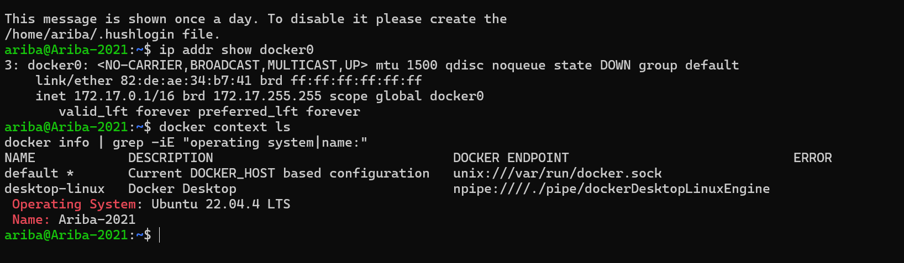

### 2. Created the project and installed the dependency

Created the project folder `~/delivery_monitoring`, a Python virtual environment, and installed the Prometheus client library:

```bash
mkdir -p ~/delivery_monitoring
cd ~/delivery_monitoring
python3 -m venv venv
source venv/bin/activate
pip install prometheus-client
```

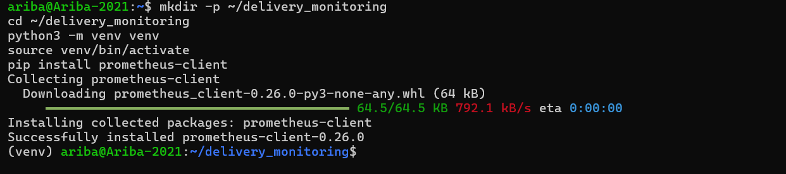

Then created the five project files (`delivery_metrics.py`, `prometheus.yml`, `alert_rules.yml`, `Dockerfile`, `Jenkinsfile`) and listed them with `ls -l`.

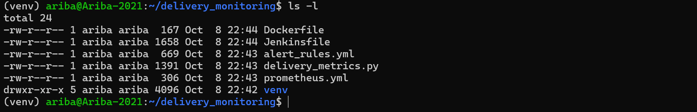

### 3. Wrote and ran the metrics application

`delivery_metrics.py` uses the `prometheus_client` library to define four metrics and updates them every second with random values:

| Metric | Type | Meaning | Simulated range |
|--------|------|---------|-----------------|
| `total_deliveries` | Gauge | Total deliveries (pending + on the way + delivered) | calculated |
| `pending_deliveries` | Gauge | Deliveries waiting to be picked up | 10 to 20 (baseline) |
| `on_the_way_deliveries` | Gauge | Deliveries currently on the way | 5 to 20 |
| `average_delivery_time` | Summary | Delivery time in seconds (exposes `_sum` and `_count`) | 15 to 45 seconds |

`start_http_server(8000, addr="0.0.0.0")` automatically creates the `/metrics` endpoint. Started the script with:

```bash
python3 delivery_metrics.py
```

The script runs forever, printing the `[DEBUG]` values each second.

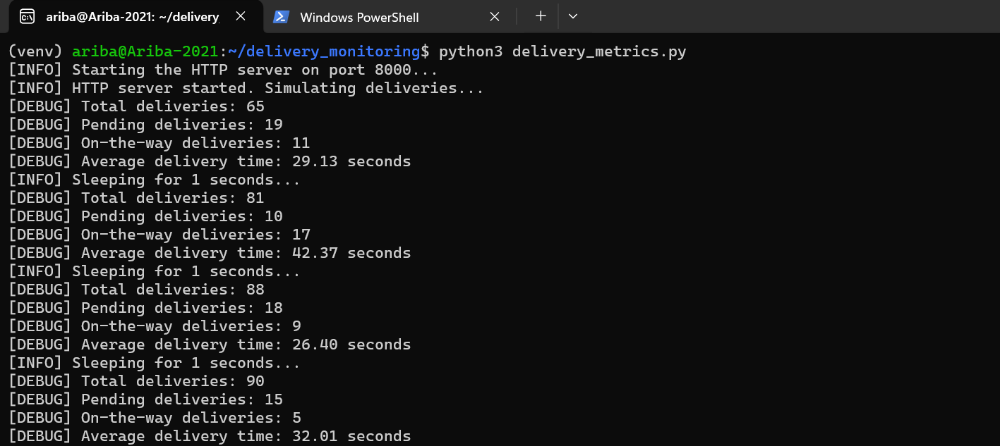

From a second Ubuntu terminal I called the endpoint with `curl` and confirmed that all four metrics are exposed (`total_deliveries`, `pending_deliveries`, `on_the_way_deliveries`, and the `average_delivery_time_count` / `average_delivery_time_sum` pair).

```bash
curl -s http://localhost:8000/metrics | grep -E "deliveries|delivery_time"
```

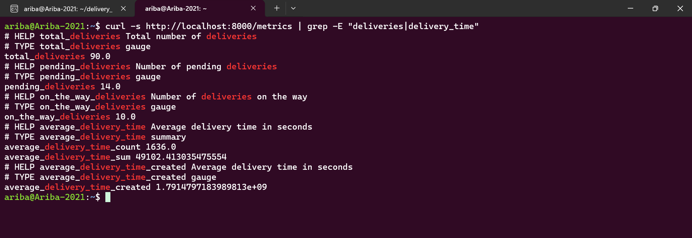

### 4. Configured and started Prometheus

`prometheus.yml` scrapes Prometheus itself and the delivery service every 5 seconds, and loads the alert rules file:

```yaml
global:
  scrape_interval: 5s
  evaluation_interval: 5s

scrape_configs:
  - job_name: "prometheus"
    static_configs:
      - targets: ["localhost:9090"]

  - job_name: "delivery_service"
    static_configs:
      - targets: ["host.docker.internal:8000"]

rule_files:
  - /etc/prometheus/alert_rules.yml
```

`alert_rules.yml` defines two alerts:

```yaml
groups:
  - name: delivery_alerts
    rules:
      - alert: HighPendingDeliveries
        expr: pending_deliveries > 10
        for: 15s
        labels:
          severity: warning
        annotations:
          summary: "High pending deliveries"
          description: "Pending deliveries are above 10 for the last 15 seconds."

      - alert: HighAverageDeliveryTime
        expr: (average_delivery_time_sum / average_delivery_time_count) > 30
        for: 15s
        labels:
          severity: critical
        annotations:
          summary: "High average delivery time"
          description: "Average delivery time is above 30 seconds for the last 15 seconds."
```

Started Prometheus as a container, mounting both config files. The `--add-host=host.docker.internal:host-gateway` flag lets the container reach the Python script running on the host:

```bash
docker run -d --name prometheus -p 9090:9090 \
  --add-host=host.docker.internal:host-gateway \
  -v $(pwd)/prometheus.yml:/etc/prometheus/prometheus.yml \
  -v $(pwd)/alert_rules.yml:/etc/prometheus/alert_rules.yml \
  prom/prometheus
```

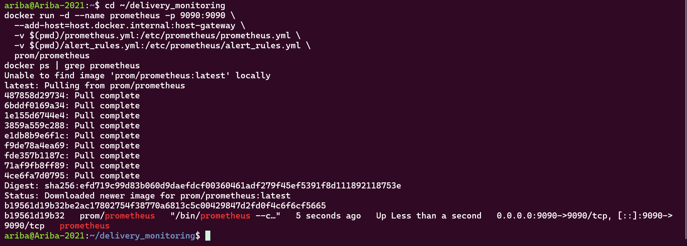

### 5. Verified Prometheus targets, queries and alert rules

At `http://localhost:9090/targets` both scrape jobs, `delivery_service` (`host.docker.internal:8000`) and `prometheus` (`localhost:9090`), are **UP**.

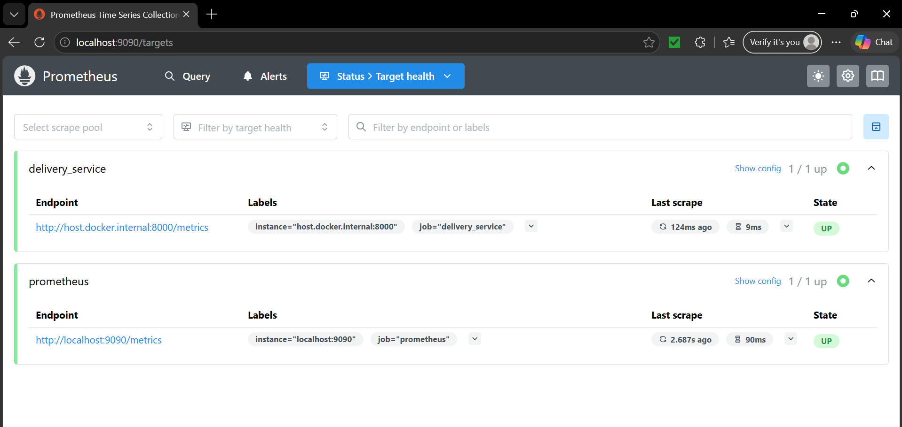

In the query page I graphed `average_delivery_time_sum / average_delivery_time_count`, which hovers just above 30 seconds (about 30.02 to 30.15) because the simulated delivery time is uniform between 15 and 45 seconds.

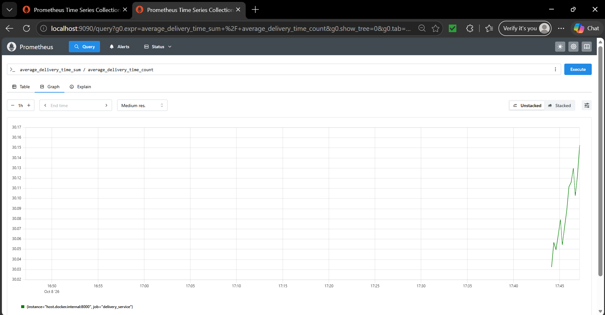

The Alerts page shows the `delivery_alerts` group loaded from `/etc/prometheus/alert_rules.yml`. With the baseline values, `HighAverageDeliveryTime` was already **FIRING** (value about 30.2, just above the 30 second threshold), while `HighPendingDeliveries` was inactive at that moment because the baseline pending values (10 to 20) sit right around its threshold of 10.

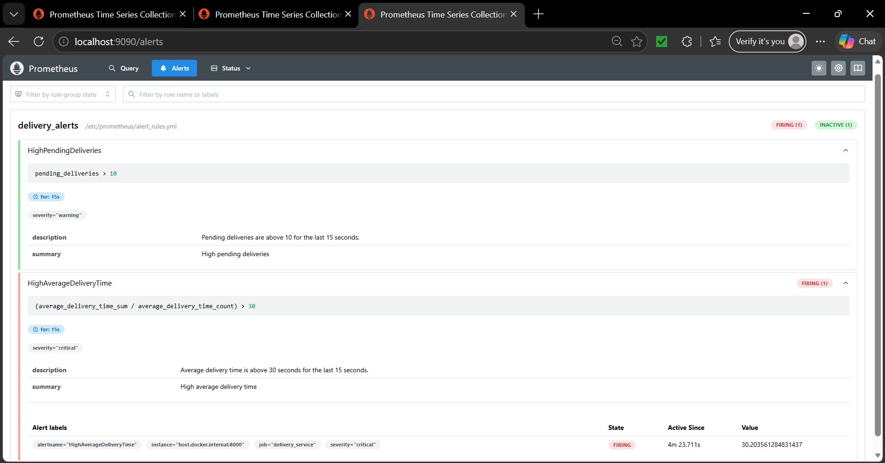

### 6. Set up Grafana and built the dashboard

Started Grafana as a container and logged in at `http://localhost:3000`:

```bash
docker run -d --name grafana -p 3000:3000 \
  --add-host=host.docker.internal:host-gateway grafana/grafana
```

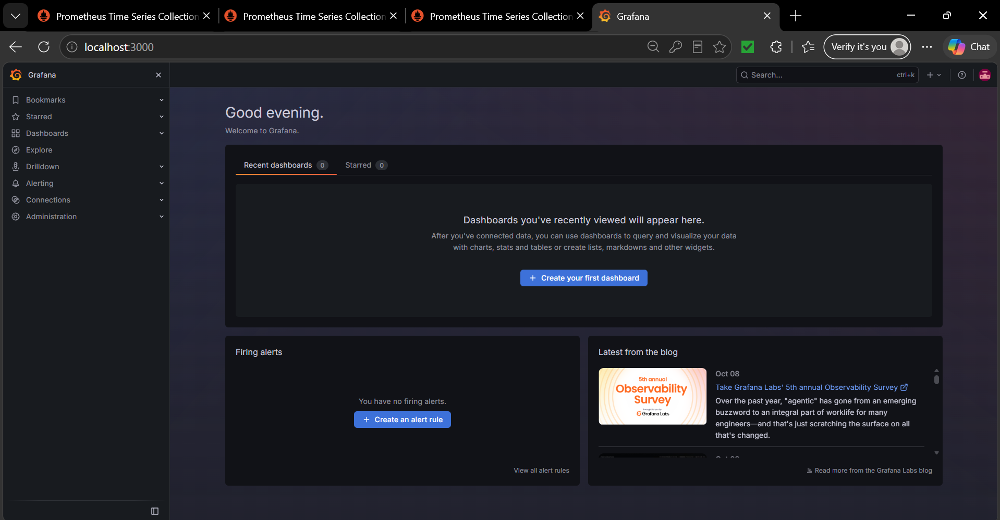

Added Prometheus as a data source with the URL `http://host.docker.internal:9090` (Save and test succeeded), then created the dashboard **ZAPPTTO Delivery Monitoring** with four panels, set to the last 5 minutes and refreshing every 5 seconds:

| Panel | Query |
|-------|-------|
| Total Deliveries | `total_deliveries` |
| Pending Deliveries | `pending_deliveries` |
| On-the-Way Deliveries | `on_the_way_deliveries` |
| Average Delivery Time | `average_delivery_time_sum / average_delivery_time_count` |

With the baseline values, pending deliveries stay between 10 and 20 and the average delivery time stays around 30 seconds.

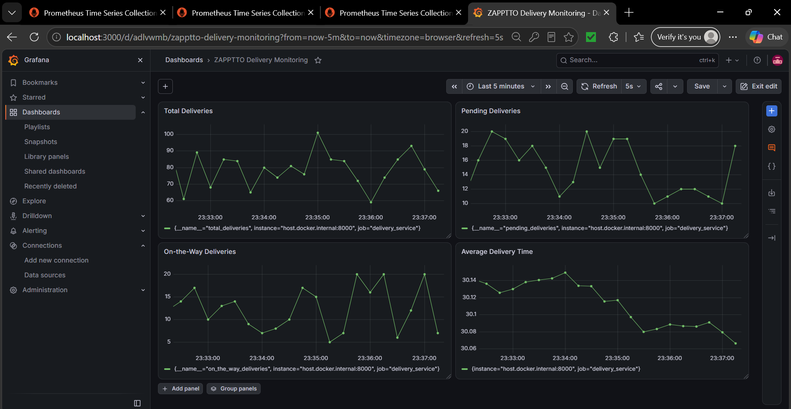

### 7. Simulated high pending deliveries and triggered the alert

Stopped the script and raised the pending range so that it clearly exceeds the alert threshold:

```bash
sed -i 's/random.randint(10, 20)/random.randint(50, 100)/' delivery_metrics.py
grep "pending =" delivery_metrics.py
python3 delivery_metrics.py
```

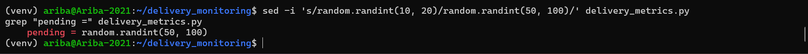

Prometheus did not need a restart, because it scrapes the endpoint every 5 seconds. After the 15 second `for` period, `HighPendingDeliveries` moved from pending to **FIRING** with a value of 100.

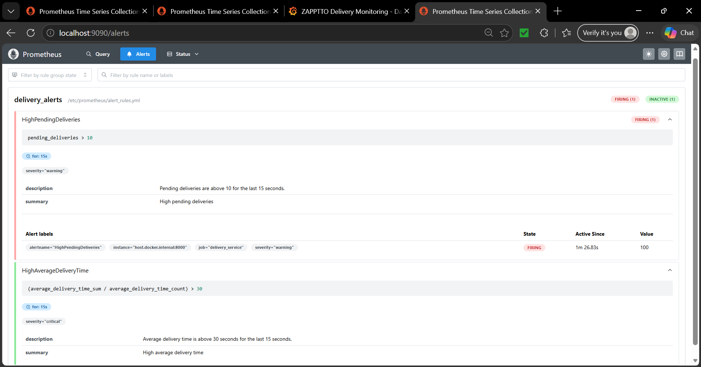

The Grafana dashboard reflects the change: the Pending Deliveries panel jumped to the 50 to 100 range and Total Deliveries rose to about 120 to 170.

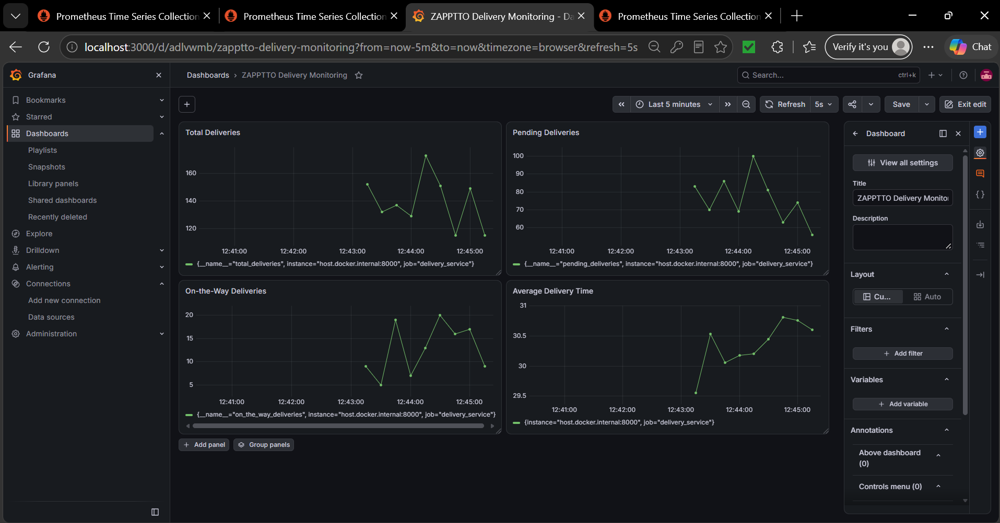

### 8. Automated the deployment with Jenkins

First I stopped the script and removed the manually started containers, so that the pipeline could reuse the same names and ports:

```bash
docker rm -f prometheus grafana
```


Started Jenkins in Docker. The host's Docker socket and the project folder are mounted into the container, and the Docker CLI is installed inside it so that pipeline steps can run `docker` commands:

```bash
docker run -d --name jenkins -u root \
  -p 8080:8080 -p 50000:50000 \
  -v jenkins_home:/var/jenkins_home \
  -v /var/run/docker.sock:/var/run/docker.sock \
  -v ~/delivery_monitoring:/project \
  jenkins/jenkins:lts

docker exec -u root jenkins bash -c "apt-get update && apt-get install -y docker.io"
docker ps | grep jenkins
```

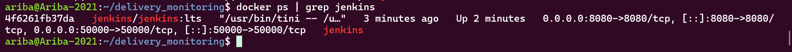

Unlocked Jenkins with the initial admin password (`docker exec jenkins cat /var/jenkins_home/secrets/initialAdminPassword`), installed the suggested plugins and created the first admin user.

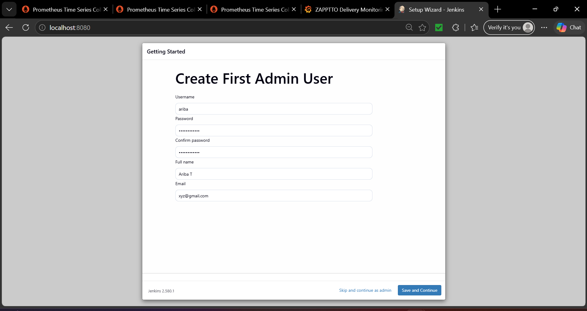

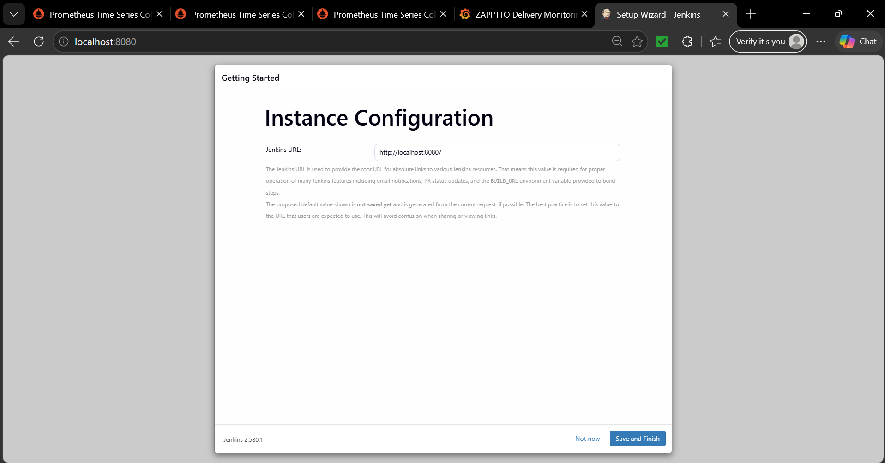

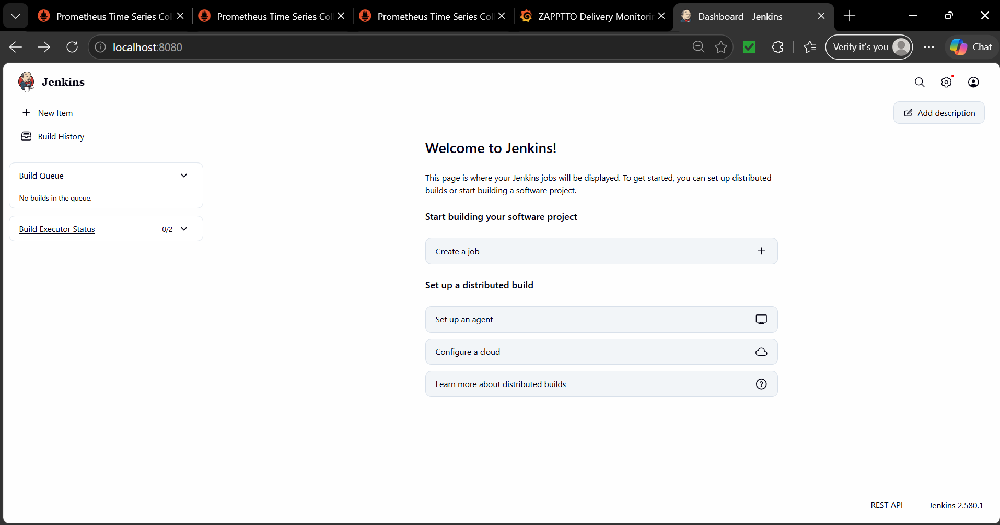

Created a new item named `delivery-monitoring` of type **Pipeline**.

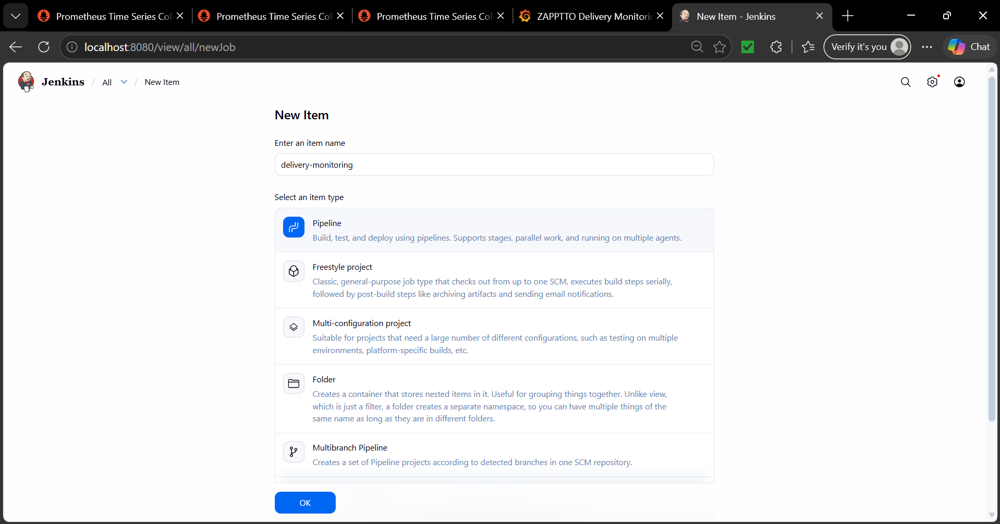

Under the Pipeline section I chose **Pipeline script** and pasted in the contents of the `Jenkinsfile`. The pipeline has six stages:

| Stage | What it does |
|-------|--------------|
| Pre-check Docker | Runs `docker --version` and `docker info` to confirm Docker is available |
| Cleanup Old Containers | Removes any old `delivery_metrics`, `prometheus` and `grafana` containers |
| Setup Workspace | Copies the project files from `/project` into the Jenkins workspace |
| Build Docker Image | `docker build -t delivery_metrics .` |
| Run Application | Starts the metrics app container on port 8000 |
| Run Prometheus & Grafana | Creates the Prometheus container, copies in `prometheus.yml` and `alert_rules.yml` with `docker cp`, starts it, then starts Grafana |

Clicked **Build Now**. Build #1 completed successfully in 1 minute 10 seconds, with every stage green.

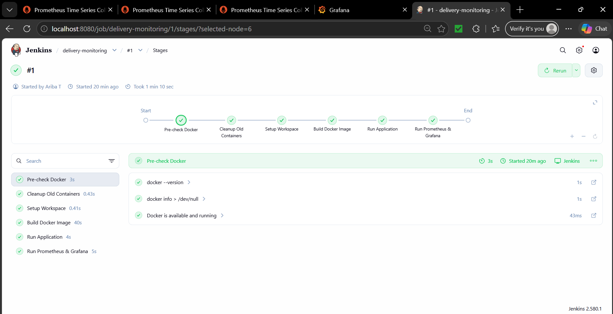

The console output shows the `docker run`, `docker create`, `docker cp` and `docker start` commands and ends with `Finished: SUCCESS`.

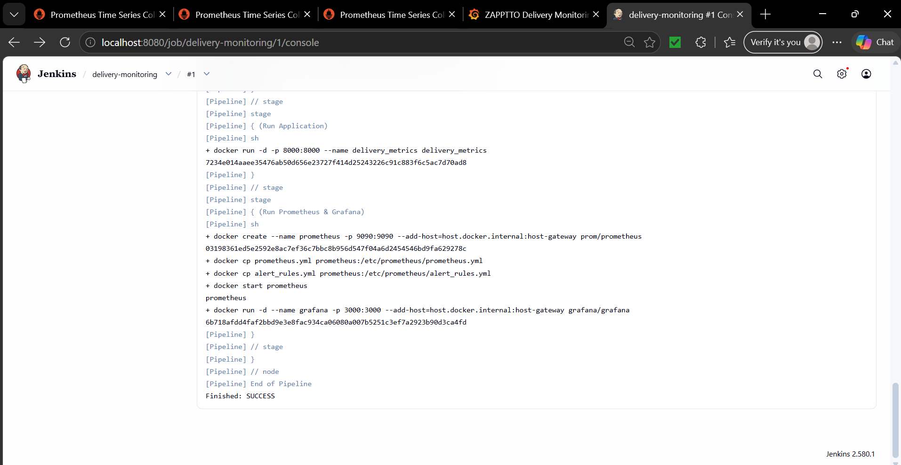

Finally, `docker ps` shows the four containers started by the pipeline and Jenkins (`grafana`, `prometheus`, `delivery_metrics`, `jenkins`) all **Up**, and `curl http://localhost:8000/metrics` returns the metrics served by the containerized app (`pending_deliveries 81.0`, within the 50 to 100 range).

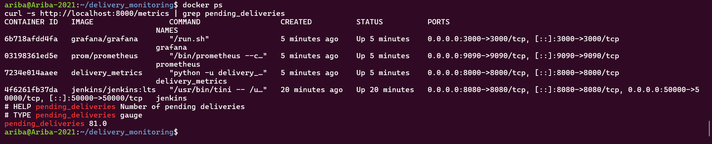

## Challenges and Fixes

- **Networking from the lab sheet:** the sheet uses `--network=host` and the host address `172.17.0.1`. In this WSL2 setup I used a normal port mapping (`-p 9090:9090`) and the hostname `host.docker.internal` together with `--add-host=host.docker.internal:host-gateway`, so the containers can reach the script and Prometheus on the host.
- **File name mismatch:** the directory listing in the lab sheet calls the file `alerts_rules.yml`, but `prometheus.yml` and the commands use `alert_rules.yml`. I used `alert_rules.yml` everywhere.
- **No Dockerfile in the lab sheet:** the Jenkinsfile runs `docker build`, so I wrote a `Dockerfile` for the metrics app.
- **Jenkins could not run Docker commands:** the standard Jenkins image has no Docker CLI and no access to the Docker daemon. I mounted `/var/run/docker.sock`, installed `docker.io` inside the container and ran Jenkins as root.
- **Placeholder source path in the Jenkinsfile:** the sheet copies files from `/path/to/your/local/files`. I mounted the project folder at `/project` in the Jenkins container and copied from there.
- **Bind mounts from the Jenkins workspace do not work:** because Jenkins talks to the host's Docker daemon, `-v $WORKSPACE/...` would resolve on the host and mount empty folders. I used `docker create` followed by `docker cp` for the Prometheus config files instead.
- **Port and name conflicts:** the pipeline starts containers with the same names and ports as the manual run. I removed the manual containers first and added a cleanup stage to the pipeline.
- **Average delivery time alert sits on the threshold:** the simulated delivery time is uniform between 15 and 45 seconds, so its long-run average is about 30 seconds and `HighAverageDeliveryTime` fires and clears around the threshold. `HighPendingDeliveries` is the alert that is triggered reliably (Step 7).

## Conclusion

The delivery metrics application, Prometheus and Grafana work together as a real-time monitoring stack: the Python script exposes four delivery metrics, Prometheus scrapes them every 5 seconds and evaluates two alert rules, and the Grafana dashboard shows the trends live. Raising the simulated pending deliveries to 50 to 100 triggered the `HighPendingDeliveries` alert in Prometheus and was visible on the dashboard. A Jenkins pipeline then rebuilt and redeployed the application, Prometheus and Grafana automatically in a single successful build.
