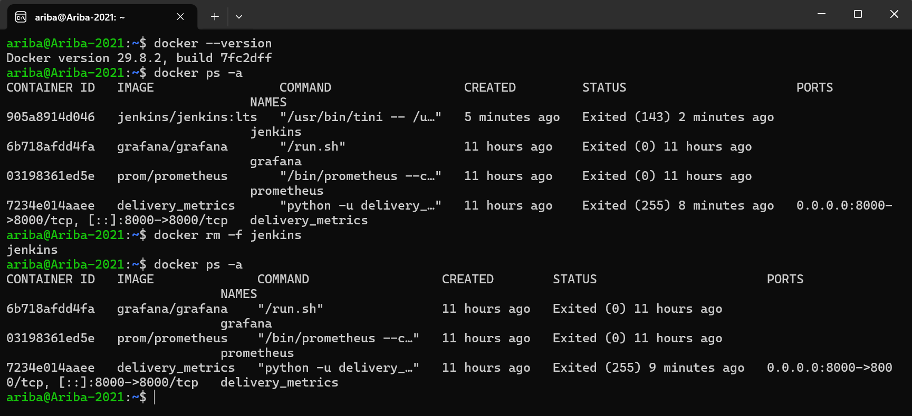
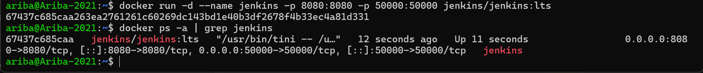
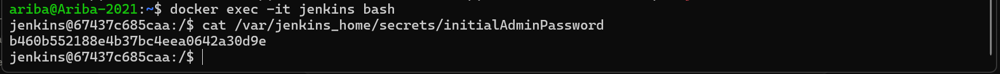
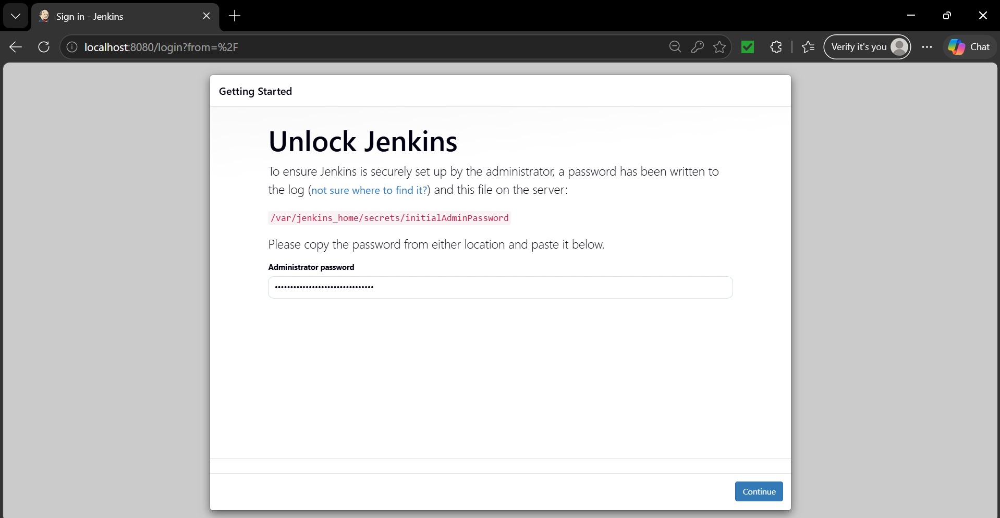
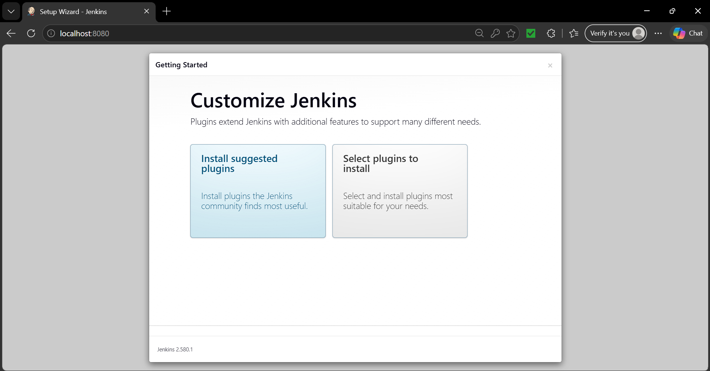
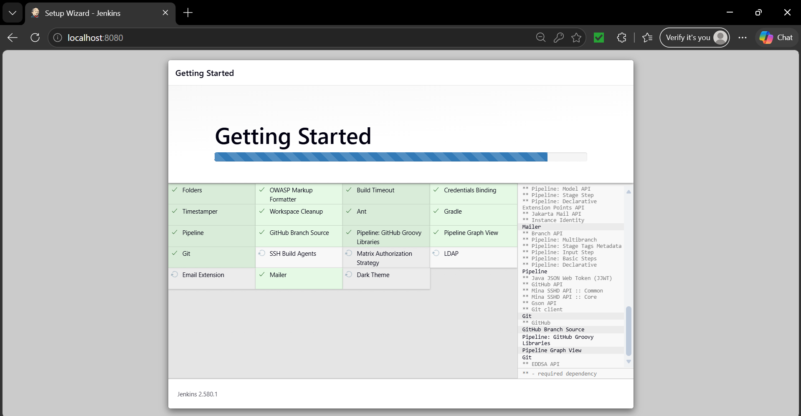
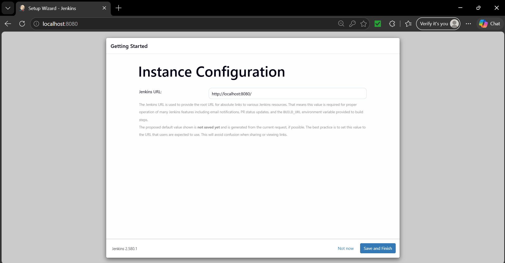
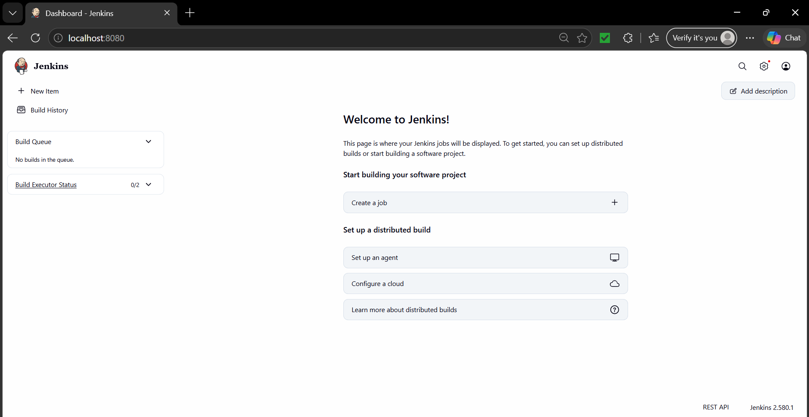

# DevOps Exercise 7: Introduction to Continuous Integration (CI) and Jenkins Installation

## Objective

Understand the idea of **Continuous Integration (CI)** and install **Jenkins**, a popular CI server, using **Docker**. The exercise covers starting the Jenkins container, retrieving the initial admin password, and completing the Jenkins setup wizard through the web interface on port 8080.

## Background

**Continuous Integration (CI)** is a development practice where developers integrate their code changes into a shared repository frequently. Every integration is verified by an automated build and automated tests, so errors are found early.

| CI feature | What it means |
|------------|---------------|
| Frequent code integration | Developers commit to a shared repository several times a day |
| Automated builds | Every commit triggers a build that verifies the change |
| Automated testing | Unit and integration tests run as part of the build |
| Immediate feedback | Developers quickly see whether their change succeeded or failed |

Benefits: early bug detection, better collaboration, faster development cycles and higher code quality.

How CI works: the developer pushes code to version control (for example Git), the CI server (for example Jenkins) detects the change and starts the build, the code is built and tested automatically, and the result is reported back to the developer.

Key Jenkins concepts:

| Concept | Meaning |
|---------|---------|
| Job / Project | A task or process that Jenkins runs |
| Build | One run of a job (compile, package, test) |
| Pipeline | A series of steps to build, test and deploy an application |
| Plugins | Extensions that add functionality (Git, Docker and others) |
| Nodes | Machines where Jenkins runs jobs (controller and agents) |

## Files in this folder

| File | Purpose |
|------|---------|
| `README.md` | This write-up |
| Screenshots (`01-` to `08-`) | Proof of each step |

This exercise has no source code. It consists of commands and the Jenkins setup screens, which are documented in the screenshots.

## Environment

- Windows with WSL2 (Ubuntu 22.04)
- Docker Engine 29.8.2 running natively inside Ubuntu
- Jenkins 2.580.1 from the `jenkins/jenkins:lts` image
- Web browser on Windows to access Jenkins at `http://localhost:8080`

## Steps Performed

### 1. Checked Docker and removed the old Jenkins container

Checked that Docker was working with `docker --version` and listed all containers with `docker ps -a`. A stopped container named `jenkins` from an earlier attempt already existed. Container names must be unique, so it had to go before the Exercise 7 command could be used. I removed it and listed the containers again to confirm that it was gone:

```bash
docker --version
docker ps -a
docker rm -f jenkins
docker ps -a
```



### 2. Installed Jenkins using Docker

Started Jenkins with the command from the lab sheet. It runs the container in the background (`-d`), names it `jenkins`, publishes the web interface on port **8080** and the agent communication port on **50000**:

```bash
docker run -d --name jenkins -p 8080:8080 -p 50000:50000 jenkins/jenkins:lts
```

Docker printed the new container ID, and `docker ps -a | grep jenkins` showed the container with status **Up** and the ports `0.0.0.0:8080->8080/tcp` and `0.0.0.0:50000->50000/tcp` mapped.



### 3. Retrieved the initial admin password

After waiting about a minute for Jenkins to start, I opened a shell inside the container and printed the generated password:

```bash
docker exec -it jenkins bash
cat /var/jenkins_home/secrets/initialAdminPassword
exit
```



This password is only valid for this local test container and is needed only once, during the first login.

### 4. Unlocked Jenkins in the browser

Opened `http://localhost:8080` in the browser. Jenkins showed the **Unlock Jenkins** page, which asks for the administrator password from the file `/var/jenkins_home/secrets/initialAdminPassword`. I pasted the password and clicked **Continue**.



### 5. Installed the suggested plugins

On the **Customize Jenkins** page, I chose **Install suggested plugins**, which installs the plugins the Jenkins community finds most useful.



The **Getting Started** screen then showed the installation progress. Plugins such as Folders, Build Timeout, Credentials Binding, Timestamper, Workspace Cleanup, Ant, Gradle, Pipeline, GitHub Branch Source, Pipeline Graph View, Git, Mailer, Email Extension, SSH Build Agents, Matrix Authorization Strategy, LDAP and Dark Theme were downloaded and installed, with dependencies listed on the right.



### 6. Created the first admin user

When the plugins had finished installing, Jenkins asked for the first admin user. I entered a username, password, full name and email address and clicked **Save and Continue**.

### 7. Confirmed the instance configuration

The **Instance Configuration** page proposes the Jenkins URL used for links generated by Jenkins (for example in notifications and build variables). I kept the default `http://localhost:8080/` and clicked **Save and Finish**.



### 8. Jenkins is ready

After clicking **Start using Jenkins**, the Jenkins dashboard opened with the message **Welcome to Jenkins!**. The dashboard offers **New Item** to create jobs and pipelines, **Build History**, the **Build Queue** (empty) and the **Build Executor Status** (0/2 executors in use). Jenkins is installed and ready to build projects.



## Challenges and Fixes

- **Container name already in use:** an earlier container called `jenkins` existed, so the lab sheet's `docker run --name jenkins` command could not create a new one. Fixed by removing the old container with `docker rm -f jenkins` before running the command.
- **Jenkins stopped when the Ubuntu window was closed:** Docker runs inside WSL2, so the container (status `Exited (143)`) stopped when WSL shut down after the terminal was closed. Fixed by recreating the container and keeping the Ubuntu window open until the setup was complete. A stopped container can also be brought back with `docker start jenkins`.
- **Jenkins needs time to start:** the web page is not ready immediately after `docker run`. Waiting about a minute before reading the password and opening the browser avoided errors.

## Notes

- The lab sheet's `docker run` command does not mount a volume, so the Jenkins data (users, plugins, jobs) lives only inside the container and is lost if the container is removed. For a setup that should survive container removal, add `-v jenkins_home:/var/jenkins_home` to the command.
- Port **8080** is the web interface and is the port reached from outside the container. Port **50000** is used by build agents that connect to Jenkins.

## Conclusion

Jenkins was installed with a single Docker command, unlocked with the initial admin password, configured with the suggested plugins and an admin user, and is now running at `http://localhost:8080`. This gives a working CI server that can be used to create jobs and pipelines which automatically build and test code after every change.
